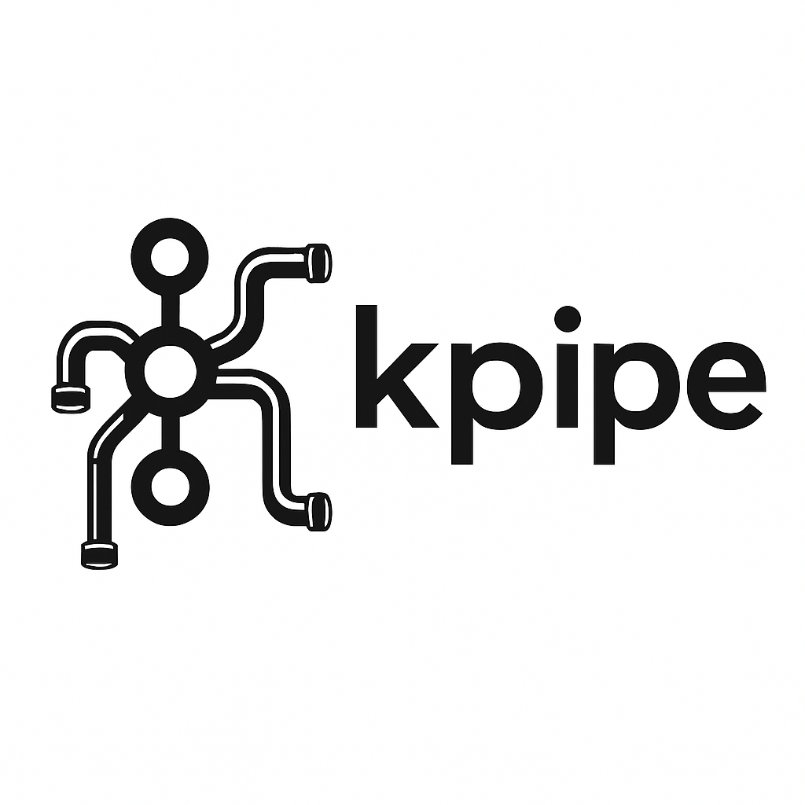

# 

# ☕ KPipe - A Modern Kafka Consumer

[](https://github.com/eschizoid/kpipe/releases/latest)
[](https://codecov.io/gh/eschizoid/kpipe)
[](https://github.com/eschizoid/kpipe/actions/workflows/ci.yaml)
[](https://opensource.org/licenses/Apache-2.0)

A **modern, functional, and high-performance Kafka consumer** built using **Java 24** features like **virtual threads**,
**composable message processors**, and **DslJson** for JSON processing. Features robust error handling, configurable
retries, built-in metrics, and support for both parallel and sequential processing. Ideal for large-scale systems.

---

## 🚀 Why This Library?

### ✅ Modern Java Features

- **Virtual Threads** for massive concurrency with minimal overhead
- **Functional programming** patterns for clean, maintainable code
- **High-performance JSON processing** with DslJson

### 🧩 Functional Processing Pipeline

- Message processors are **pure functions** (`Function<V, V>`) that transform data without side effects
- Build complex pipelines through **function composition** using `Function::andThen` or the registry
- **Declarative processing** lets you describe *what* to do, not *how* to do it
- **Higher-order functions** enable conditional processing, retry logic, and error handling
- Teams can **register their own processors** in a central registry via:

  ```java
  // Register team-specific processors
  MessageProcessorRegistry.register("sanitizeData",
      JsonMessageProcessor.removeFields("password", "ssn"));

  // Create pipelines from registered processors
  final var pipeline = MessageProcessorRegistry.pipeline(
      "parseJson", "validateSchema", "sanitizeData", "addMetadata");

  // Apply transformations with built-in error handling and retry logic
  final var consumer = new FunctionalConsumer.<byte[], byte[]>builder()
    .withProcessor(pipeline)
    .withRetry(3, Duration.ofSeconds(1))
    .build();
  consumer.start();
  ```

  ```java
  // Register custom processors for your team's needs
  MessageProcessorRegistry.register("extractMetadata", message -> {
    // Custom extraction logic here
    return processedMessage;
  });

  // Load processors from configuration
  String[] configuredProcessors = config.getStringArray("message.processors");
  Function<byte[], byte[]> pipeline = MessageProcessorRegistry.pipeline(configuredProcessors);

  // Create a consumer with team-specific processing pipeline
  final var consumer = new FunctionalConsumer.<byte[], byte[]>builder()
    .withProperties(kafkaProps)
    .withTopic("team-topic")
    .withProcessor(MessageProcessorRegistry.pipeline(
        "parseJson",
        "validateSchema",
        "extractMetadata",
        "addTeamIdentifier"))
  .withErrorHandler(error -> publishToErrorTopic(error))
  .withRetry(3, Duration.ofSeconds(1))
  .build();

  // Use the consumer
  consumer.start();
  ```

---

## 📦 Installation

### Maven

  ```xml
  <dependency>
      <groupId>io.github.eschizoid</groupId>
      <artifactId>kpipe</artifactId>
      <version>0.2.0</version>
  </dependency>
  ```

### Gradle (Groovy)

  ```groovy
  implementation 'io.github.eschizoid:kpipe:0.2.0'
  ```

### Gradle (Kotlin)

  ```kotlin
  implementation("io.github.eschizoid:kpipe:0.2.0")
  ```

### SBT

  ```sbt
  libraryDependencies += "io.github.eschizoid" % "kpipe" % "0.2.0"
  ```

---

## 📁 Project Structure

KPipe is organized into two main modules:

### Library Module (lib)

The core library that provides the Kafka consumer functionality:

```
├── src/main/java/org/kpipe/
│   ├── consumer/                         # Core consumer components
│   │   ├── FunctionalConsumer.java       # Main functional consumer implementation
│   │   ├── OffsetManager.java            # Manages Kafka offsets for reliable processing
│   │   ├── MessageTracker.java           # Tracks message processing state
│   │   ├── RebalanceListener.java        # Handles Kafka consumer rebalancing
│   │   └── enums/                        # Enums for consumer states and commands
│   │
│   ├── processor/                        # Message processors
│   │   └── JsonMessageProcessor.java     # JSON processing with DslJson
│   │
│   ├── registry/                         # Registry components
│   │   ├── MessageProcessorRegistry.java # Registry for processor functions
│   │   ├── MessageSinkRegistry.java      # Registry for message sinks
│   │   └── RegistryFunctions.java        # Shared utilities for registries
│   │
│   ├── sink/                             # Message sink implementations
│   │   ├── ConsoleSink.java              # Console sink implementation
│   │   └── MessageSink.java              # Message sink interface
│   │
│   ├── config/                           # Configuration components
│   │   ├── AppConfig.java                # Application configuration
│   │   └── KafkaConsumerConfig.java      # Kafka consumer configuration
│   │
│   └── metrics/                          # Metrics components
│       ├── ConsumerMetricsReporter.java  # Reports consumer metrics
│       ├── MetricsReporter.java          # Metrics reporting interface
│       └── ProcessorMetricsReporter.java # Reports processor metrics
```

### Application Module (app)

A ready-to-use application that demonstrates the library:

```
├── src/main/java/org/kpipe/
│   └── App.java                          # Main application class
```

---

## ⚙️ Example: Add Custom Processor

Extend the registry like this:

  ```java
  // Register a processor for JSON field transformations
  MessageProcessorRegistry.register("uppercase", bytes ->
      JsonMessageProcessor.transformField("text", value -> {
          if (value instanceof String text) {
              return text.toUpperCase();
          }
          return value;
      }).apply(bytes)
  );

  // Register a processor that adds environment information
  MessageProcessorRegistry.register("addEnvironment",
      JsonMessageProcessor.addField("environment", "production"));

  // Create a reusable processor pipeline
  final var pipeline = MessageProcessorRegistry.pipeline(
      "parseJson", "validateSchema", "addEnvironment", "uppercase", "addTimestamp"
  );

  // Use the pipeline with a consumer
  final var consumer = new FunctionalConsumer.<byte[], byte[]>builder()
      .withProperties(kafkaProps)
      .withTopic("events")
      .withProcessor(pipeline)
      .withRetry(3, Duration.ofSeconds(1))
      .build();

  // Start processing messages
  consumer.start();
  ```

---

## 📊 Built-in Metrics

Monitor your consumer with built-in metrics:

  ```java
  // Access consumer metrics
  Map<String, Long> metrics = consumer.getMetrics();
  System.out.println("Messages received: " + metrics.get("messagesReceived"));
  System.out.println("Successfully processed: " + metrics.get("messagesProcessed"));
  System.out.println("Processing errors: " + metrics.get("processingErrors"));
  ```

Configure automatic metrics reporting:

  ```java
  new App(config)
    .withMetricsInterval(Duration.ofSeconds(30))
    .start();
  ```

---

## 🛡️ Graceful Shutdown
The consumer supports graceful shutdown with in-flight message handling:

  ```java
  // Initiate graceful shutdown with 5-second timeout
  boolean allProcessed = kafkaApp.shutdownGracefully(5000);
  if (allProcessed) {
    LOGGER.info("All messages processed successfully before shutdown");
  } else {
    LOGGER.warning("Shutdown completed with some messages still in flight");
  }

  // Register as JVM shutdown hook
  Runtime.getRuntime().addShutdownHook(
    new Thread(() -> app.shutdownGracefully(5000))
  );
  ```

---

## 🔧 Working with JSON

The JSON processors handle deserialization and transformation of JSON data:

  ```java
  // Add a timestamp field to messages
  final var addTimestampProcessor = JsonMessageProcessor.addTimestamp("processedAt");

  // Remove sensitive fields
  final var sanitizeProcessor = JsonMessageProcessor.removeFields("password", "ssn", "creditCard");

  // Transform specific fields
  final var uppercaseSubjectProcessor = JsonMessageProcessor.transformField("subject", value -> {
      if (value instanceof String text) {
          return text.toUpperCase();
      }
      return value;
  });

  // Add metadata to messages
  final var metadata = new HashMap<String, Object>();
  metadata.put("version", "1.0");
  metadata.put("environment", "production");
  var addMetadataProcessor = JsonMessageProcessor.mergeWith(metadata);

  // Combine processors into a pipeline
  Function<byte[], byte[]> pipeline = message -> addMetadataProcessor.apply(
      uppercaseSubjectProcessor.apply(
          sanitizeProcessor.apply(
              addTimestampProcessor.apply(message)
          )
      )
  );

  // Or use the registry to build pipelines
  final var registryPipeline = MessageProcessorRegistry.pipeline(
      "sanitize", "addTimestamp", "uppercaseSubject", "addMetadata"
  );
  ```

---

## 🔍 Application Example

Here's a concise example of a KPipe application:

```java
public class KPipeApp implements AutoCloseable {
  private final ConsumerRunner<FunctionalConsumer<byte[], byte[]>> runner;
  
  public static void main(final String[] args) {
    // Load configuration from environment variables
    final var config = AppConfig.fromEnv();

    try (final var app = new MyKafkaApp(config)) {
      app.start();
      app.awaitShutdown();
    } catch (final Exception e) {
      System.getLogger(MyKafkaApp.class.getName())
        .log(System.Logger.Level.ERROR, "Fatal error in application", e);
      System.exit(1);
    }
  }

  public MyKafkaApp(final AppConfig config) {
    // Create processor and sink registries
    final var processorRegistry = new MessageProcessorRegistry(config.appName());
    final var sinkRegistry = new MessageSinkRegistry();
    
    // Create the functional consumer
    final var functionalConsumer = FunctionalConsumer.<byte[], byte[]>builder()
      .withProperties(KafkaConsumerConfig.createConsumerConfig(
        config.bootstrapServers(), config.consumerGroup()))
      .withTopic(config.topic())
      .withProcessor(processorRegistry.pipeline(
        "parseJson", "addSource", "markProcessed", "addTimestamp"))
      .withMessageSink(sinkRegistry.<byte[], byte[]>pipeline("logging"))
      .withOffsetManagerProvider(consumer -> 
        OffsetManager.builder(consumer)
          .withCommitInterval(Duration.ofSeconds(30))
          .build())
      .withMetrics(true)
      .build();
    
    // Set up the consumer runner with metrics and shutdown hooks
    runner = ConsumerRunner.builder(functionalConsumer)
      .withMetricsInterval(config.metricsInterval().toMillis())
      .withShutdownTimeout(config.shutdownTimeout().toMillis())
      .withShutdownHook(true)
      .build();
  }
  
  public void start() { runner.start(); }
  public boolean awaitShutdown() { return runner.awaitShutdown(); }
  public void close() { runner.close(); }
}
```

**Key Components:**
- Configuration from environment variables
- Processor and sink registries for message handling
- Processing pipeline with error handling
- Metrics reporting and graceful shutdown

**To Run:**
```bash
# Set configuration
export KAFKA_BOOTSTRAP_SERVERS=localhost:9092
export KAFKA_CONSUMER_GROUP=my-group
export KAFKA_TOPIC=json-events

# Run the application
./gradlew run

# Test with a sample message
echo '{"message":"Hello from KPipe!"}' | kcat -P -b localhost:9092 -t json-events
```

---

## 🛠️ Requirements

- Java 24+
- Gradle (for building the project)
- [kcat](https://github.com/edenhill/kcat) (for testing)
- Docker (for local Kafka setup)

---

## ⚙️ Configuration

Configure via environment variables:

  ```bash
  export KAFKA_BOOTSTRAP_SERVERS=localhost:9092
  export KAFKA_CONSUMER_GROUP=my-consumer-group
  export KAFKA_TOPIC=json-events
  export KAFKA_PROCESSORS=parseJson,validateSchema,addTimestamp
  export METRICS_INTERVAL_MS=30000
  export SHUTDOWN_TIMEOUT_MS=5000
  ```

---

## 🧪 Testing

Follow these steps to test the KPipe Kafka Consumer:

### Build and Run

  ```bash
  # Format code and build the library module
  ./gradlew clean :lib:spotlessApply :lib:build
  
  # Format code and build the applications module
  ./gradlew :app:clean :app:spotlessApply :app:build

  # Build the consumer app container and start all services
  docker compose build --no-cache --build-arg MESSAGE_FORMAT=<json|avro|protobuf>
  docker compose down -v
  docker compose up -d

  # Publish a simple JSON message to the json-topic
  echo '{"message":"Hello world"}' | kcat -P -b kafka:9092 -t json-topic

  # For complex JSON messages, use a file
  cat test-message.json | kcat -P -b kafka:9092 -t json-topic

  # Publish multiple test messages
  for i in {1..10}; do echo "{\"id\":$i,\"message\":\"Test message $i\"}" | \
    kcat -P -b kafka:9092 -t json-topic; done
  ```

### Working with the Schema Registry and Avro

If you want to use Avro with a schema registry, follow these steps:

  ```bash
  # Register an Avro schema
  curl -X POST \
    -H "Content-Type: application/vnd.schemaregistry.v1+json" \
    --data "{\"schema\": $(cat lib/src/test/resources/avro/customer.avsc | jq tostring)}" \
    http://localhost:8081/subjects/com.kpipe.customer/versions
  
  # Read registered schema 
  curl -s http://localhost:8081/subjects/com.kpipe.customer/versions/latest | jq -r '.schema' | jq --indent 2 '.'
  
  # Produce an Avro message using kafka-avro-console-producer
  echo '{"id":1,"name":"Mariano Gonzalez","email":{"string":"mariano@example.com"},"active":true,"registrationDate":1635724800000,"address":{"com.kpipe.customer.Address":{"street":"123 Main St","city":"Chicago","zipCode":"00000","country":"USA"}},"tags":["premium","verified"],"preferences":{"notifications":"email"}}' \
  | docker run -i --rm --network=host confluentinc/cp-schema-registry:latest \
      kafka-avro-console-producer \
      --broker-list localhost:9092 \
      --topic avro-topic \
      --property schema.registry.url=http://localhost:8081 \
      --property value.schema.id=1
  ```

Kafka consumer will:

- Connect to `localhost:9092`
- Subscribe to `avro-topic|json-topic|protobuf-topic`
- Compose the processing pipeline from configured processors
- Process each message concurrently using virtual threads

---

## 🔍 Best Practices & Advanced Patterns

### Composing Complex Processing Pipelines

For maintainable pipelines, group related processors:

  ```java
  // Create focused processor groups
  final var securityProcessors = MessageProcessorRegistry.pipeline(
      "sanitizeData", "encryptSensitiveFields", "addAuditTrail");

  final var enrichmentProcessors = MessageProcessorRegistry.pipeline(
      "addMetadata", "addTimestamp", "addEnvironment");

  // Compose them into a master pipeline
  final var fullPipeline = message -> enrichmentProcessors.apply(
      securityProcessors.apply(message));

  // Or register the composed pipeline
  MessageProcessorRegistry.register("standardProcessing", fullPipeline);
  ```

### Conditional Processing

The library provides a built-in `when()` method for conditional processing:

  ```java
  // Create a predicate that checks message type
  Predicate<byte[]> isOrderMessage = message -> {
      try {
          Map<String, Object> parsed = JsonMessageProcessor.parseJson().apply(message);
          return "ORDER".equals(parsed.get("type"));
      } catch (Exception e) {
          return false;
      }
  };

  // Use the built-in conditional processor
  Function<byte[], byte[]> conditionalProcessor = MessageProcessorRegistry.when(
      isOrderMessage,
      MessageProcessorRegistry.get("orderEnrichment"),
      MessageProcessorRegistry.get("defaultEnrichment")
  );

  // Register the conditional pipeline
  MessageProcessorRegistry.register("smartProcessing", conditionalProcessor);
  ```

### Thread-Safety Considerations
- Message processors should be stateless and thread-safe
- Avoid shared mutable state between processors
- Use immutable data structures where possible
- For processors with side effects (like database calls), consider using thread-local variables

### Performance Optimization
- Register frequently used processor combinations as single processors
- For very large messages, consider streaming JSON processors
- Profile your processor pipeline to identify bottlenecks

---

## 📈 Performance Notes

- Virtual threads are **1:1 with Kafka records** — scales to 100k+ messages/sec
- Zero-GC JSON processing
- Safe and efficient memory model using modern Java features

---

## 📚 Inspiration

This library is inspired by the best practices from:

- [Project Loom](https://openjdk.org/projects/loom/)
- [High-performance JSON libraries (DslJson)](https://github.com/ngs-doo/dsl-json)

---

## 💬 Contributing

If you're a team using this library, feel free to:

- Register custom processors
- Add metrics/observability hooks
- Share improvements or retry strategies

---

## 📄 License

This project is licensed under the Apache License 2.0 - see the [LICENSE](LICENSE) file for details.

---

## 🧠 Final Thoughts

This Kafka consumer is:

- **Functional**
- **Extensible**
- **Future-proof**

Use it to modernize your Kafka stack with **Java 24 elegance and performance**.
