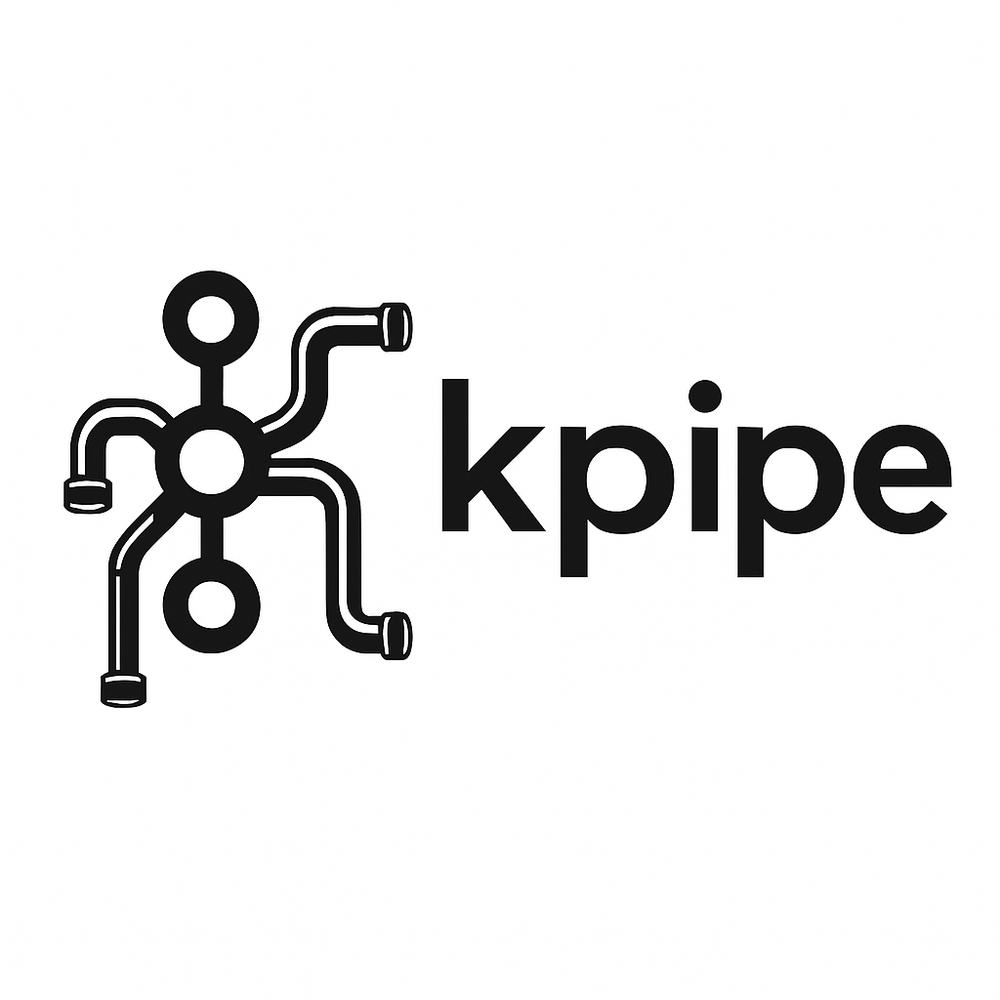

# 

# KPipe

**KPipe is a lightweight Kafka processing library for modern Java that lets you build safe, high‑performance message
pipelines using virtual threads and a functional API.**

[](https://github.com/eschizoid/kpipe/releases/latest)
[](https://codecov.io/gh/eschizoid/kpipe)
[](https://github.com/eschizoid/kpipe/actions/workflows/ci.yaml)
[](https://opensource.org/licenses/Apache-2.0)

- **Modern Java concurrency** (virtual threads)
- **Composable functional pipelines**
- **Safe at-least-once processing**
- **Backpressure** to protect downstream systems
- **High throughput with minimal framework overhead**

It is designed for Kafka consumer services performing transformations, enrichment, or routing.

---

# Quick Example

Create a pipeline and start a Kafka consumer in a few lines:

```java
final var registry = new MessageProcessorRegistry("demo");

final var sanitizeKey = RegistryKey.json("sanitize");
registry.registerOperator(sanitizeKey, JsonMessageProcessor.removeFieldsOperator("password"));

final var stampKey = RegistryKey.json("stamp");
registry.registerOperator(stampKey, JsonMessageProcessor.addTimestampOperator("processedAt"));

final var pipeline = registry.jsonPipelineBuilder()
  .add(sanitizeKey)
  .add(stampKey)
  .build();

final var consumer = KPipeConsumer.<byte[], byte[]>builder()
  .withProperties(kafkaProps)
  .withTopic("users")
  .withProcessor(pipeline)
  .withRetry(3, Duration.ofSeconds(1))
  .build();

  // Use the consumer
  consumer.start();
```

KPipe handles:

- record processing
- retries
- metrics
- offset tracking
- safe commits

---

# When to Use KPipe

KPipe works well for:

- Kafka consumer microservices
- event enrichment pipelines
- lightweight transformation services
- I/O-bound processing (REST calls, database lookups)
- teams adopting **modern Java concurrency**

KPipe is not intended to replace large streaming frameworks. It focuses on **simple, composable Kafka consumer
pipelines.**

---

# Why Not Just Use Kafka Streams?

Kafka Streams is powerful but introduces a full topology framework and state management layer that many services do not
need.

KPipe focuses on **code-first pipelines with minimal infrastructure overhead.**

| Capability                       | Kafka Streams | Reactor Kafka | KPipe |
| -------------------------------- | ------------- | ------------- | ----- |
| Full stream processing framework | Yes           | No            | No    |
| Lightweight consumer pipelines   | Partial       | Yes           | Yes   |
| Virtual-thread friendly          | No            | No            | Yes   |
| Functional pipeline API          | Yes           | Yes           | Yes   |
| Minimal dependencies             | No            | Yes           | Yes   |

KPipe sits between **raw KafkaConsumer code and full streaming frameworks.**

---

## Installation

### Maven

```xml
<dependency>
    <groupId>io.github.eschizoid</groupId>
    <artifactId>kpipe</artifactId>
    <version>1.4.0</version>
</dependency>
```

### Gradle (Groovy)

```groovy
implementation 'io.github.eschizoid:kpipe:1.4.0'
```

### Gradle (Kotlin)

```kotlin
implementation("io.github.eschizoid:kpipe:1.4.0")
```

### SBT

```sbt
libraryDependencies += "io.github.eschizoid" % "kpipe" % "1.4.0"
```

---

## Architecture and Reliability

KPipe is designed to be a lightweight, high-performance alternative to existing Kafka consumer libraries, focusing on
modern Java 24+ features (Virtual Threads, Scoped Values) and predictable behavior.

### 1. The "Single SerDe Cycle" Strategy

Unlike traditional pipelines that often perform `byte[] -> Object -> byte[]` at every transformation step, KPipe
optimizes for throughput:

- **Single Deserialization**: Messages are deserialized **once** into a mutable representation (e.g., `Map` for JSON,
  `GenericRecord` for Avro).
- **In-Place Transformations**: A chain of `UnaryOperator` functions is applied to the same object.
- **Single Serialization**: The final object is serialized back to `byte[]` only once before being sent to the sink.

This approach significantly reduces CPU overhead and GC pressure.

### 2. Virtual Threads and Scoped Values

KPipe uses **Java Virtual Threads** (Project Loom) for high-concurrency message processing.

- **Efficient Resource Reuse**: Heavy objects like `Schema.Parser`, `ByteArrayOutputStream`, and Avro encoders are
  cached per virtual thread using `ScopedValue`, which is significantly more lightweight than `ThreadLocal`.
  - **Optimization**: `ScopedValue` allows KPipe to share these heavy resources across all transformations in a single
    pipeline without the memory leak risks or scalability bottlenecks of `ThreadLocal` in a virtual-thread-per-record
    model.
- **Thread-Per-Record**: Each message is processed in its own virtual thread, allowing KPipe to scale to millions of
  concurrent operations without the overhead of complex thread pools.

### 3. Reliable "At-Least-Once" Delivery

KPipe implements a **Lowest Pending Offset** strategy to ensure reliability even with parallel processing:

- **Pluggable Offset Management**: Use the `OffsetManager` interface to customize how offsets are stored (Kafka-based or
  external database).
- **In-Flight Tracking**: Every record's offset is tracked in a `ConcurrentSkipListSet` per partition (in
  `KafkaOffsetManager`).
- **No-Gap Commits**: Even if message 102 finishes before 101, offset 102 will **not** be committed until 101 is
  successfully processed.
- **Crash Recovery**: If the consumer crashes, it will resume from the last committed "safe" offset. While this may
  result in some records being re-processed (standard "at-least-once" behavior), it guarantees no message is ever
  skipped.

### 4. Parallel vs. Sequential Processing

KPipe supports two modes of execution depending on your ordering and throughput requirements:

- **Parallel Mode (Default)**: Best for stateless transformations (enrichment, masking). High throughput via virtual
  threads. Offsets are committed based on the **lowest pending offset** to ensure no gaps.
- **Sequential Mode (`.withSequentialProcessing(true)`)**: Best for stateful transformations where order per partition
  is critical (e.g., balance updates, sequence-dependent events). In this mode, only one message per partition is
  processed at a time. Backpressure is supported and operates by monitoring the **consumer lag** (the difference between
  the partition end-offset and the consumer's current position).

### 5. External Offset Management

While Kafka-based offset storage is the default, KPipe supports external storage (e.g., PostgreSQL) for **exactly-once
processing** or specific architectural needs.

1.  **Seek on Assignment**: When partitions are assigned, fetch the last processed offset from your database and call
    `consumer.seek(partition, offset + 1)`.
2.  **Update on Processed**: Implement `markOffsetProcessed` to save the offset to the database.

```java
public class PostgresOffsetManager<K, V> implements OffsetManager<K, V> {

  private final Consumer<K, V> consumer;

  // ... DB connection ...

  @Override
  public void markOffsetProcessed(final ConsumerRecord<K, V> record) {
    // SQL: UPDATE offsets SET offset = ? WHERE partition = ?
  }

  @Override
  public ConsumerRebalanceListener createRebalanceListener() {
    return new ConsumerRebalanceListener() {
      @Override
      public void onPartitionsAssigned(final Collection<TopicPartition> partitions) {
        for (var tp : partitions) {
          long lastOffset = fetchFromDb(tp);
          consumer.seek(tp, lastOffset + 1);
        }
      }
      // ...
    };
  }
  // ...
}
```

### 5. Error Handling & Retries

KPipe provides a robust, multi-layered error handling mechanism:

- **Built-in Retries**: Configure `.withRetry(maxRetries, backoff)` to automatically retry transient failures.
- **Dead Letter Handling**: Provide a `.withErrorHandler()` to redirect messages that fail after all retries to an error
  topic or database.
- **Safe Pipelines**: Use `MessageProcessorRegistry.withErrorHandling()` to wrap individual processors with default
  values or logging, preventing a single malformed message from blocking the partition.

### 6. Backpressure

When a downstream sink (database, HTTP API, another Kafka topic) is slow, KPipe can automatically pause Kafka polling to
prevent unbounded resource consumption or excessive lag.

Backpressure uses **two configurable watermarks** (hysteresis) to avoid rapid pause/resume oscillation:

- **High watermark** — pause Kafka polling when the monitored metric reaches this value.
- **Low watermark** — resume Kafka polling when the metric drops to or below this value.

#### Backpressure Strategies

KPipe automatically selects the optimal backpressure strategy based on your processing mode:

| Mode                   | Strategy         | Metric Monitored               | Use Case                                                       |
| :--------------------- | :--------------- | :----------------------------- | :------------------------------------------------------------- |
| **Parallel** (Default) | **In-Flight**    | Total active virtual threads   | Prevent memory exhaustion from too many concurrent tasks.      |
| **Sequential**         | **Consumer Lag** | Total unread messages in Kafka | Prevent the consumer from falling too far behind the producer. |

##### 1. In-Flight Strategy (Parallel Mode)

In parallel mode, multiple messages are processed concurrently using Virtual Threads. The backpressure controller
monitors the number of messages currently "in-flight" (started but not yet finished).

- **High Watermark Default**: 10,000
- **Low Watermark Default**: 7,000

##### 2. Consumer Lag Strategy (Sequential Mode)

In sequential mode, messages are processed one by one to maintain strict ordering. Since only one message is ever
in-flight, KPipe instead monitors the **total consumer lag** across all assigned partitions.

The lag is calculated using the formula:

```
lag = Σ (endOffset - position)
```

Where:

- `endOffset`: The highest available offset in a partition.
- `position`: The offset of the next record to be fetched by this consumer.

- **High Watermark Default**: 10,000
- **Low Watermark Default**: 7,000

#### Configuration

```java
final var consumer = KPipeConsumer.<byte[], byte[]>builder()
  .withProperties(kafkaProps)
  .withTopic("events")
  .withProcessor(pipeline)
  // Enable backpressure with default watermarks (10k / 7k)
  .withBackpressure()
  // Or configure explicit watermarks:
  // .withBackpressure(5_000, 3_000)
  .build();
```

**Backpressure is disabled by default** and opt-in via `.withBackpressure()`.

**Observability:** backpressure events are logged (WARNING on pause, INFO on resume) and tracked via two dedicated
metrics: `backpressurePauseCount` and `backpressureTimeMs`.

### 7. Graceful Shutdown & Interrupt Handling

KPipe respects JVM signals and ensures timely shutdown without data loss:

- **Interrupt Awareness**: Interrupts trigger a coordinated shutdown sequence. They do **not** cause records to be
  skipped.
- **Reliable Redelivery**: If a record's processing is interrupted (e.g., during retry backoff or transformation), the
  offset is NOT marked as processed. This ensures it will be safely picked up by the next consumer instance,
  guaranteeing "at-least-once" delivery even during shutdown.

---

## Example: Add Custom Processor

Extend the registry like this:

```java
// Create a registry
final var registry = new MessageProcessorRegistry("myApp");

// Register a custom JSON operator for field transformations
final var uppercaseKey = RegistryKey.json("uppercase");
registry.registerOperator(uppercaseKey, map -> {
    final var value = map.get("text");
    if (value instanceof String text) map.put("text", text.toUpperCase());
    return map;
});

// Built-in operators are also available
final var envKey = RegistryKey.json("addEnvironment");
registry.registerOperator(envKey,
    JsonMessageProcessor.addFieldOperator("environment", "production"));

// Create a high-performance pipeline (single SerDe cycle)
final var pipeline = registry.jsonPipelineBuilder()
    .add(envKey)
    .add(uppercaseKey)
    .add(MessageProcessorRegistry.JSON_ADD_TIMESTAMP)
    .build();

// Use the pipeline with a consumer
final var consumer = KPipeConsumer.<byte[], byte[]>builder()
    .withProperties(kafkaProps)
    .withTopic("events")
    .withProcessor(pipeline)
    .withRetry(3, Duration.ofSeconds(1))
    .build();

// Start processing messages
consumer.start();
```

---

## Built-in Metrics

Monitor your consumer with built-in metrics:

```java
// Access consumer metrics
final var metrics = consumer.getMetrics();
final var log = System.getLogger("org.kpipe.metrics");
log.log(Level.INFO, "Messages received: " + metrics.get("messagesReceived"));
log.log(Level.INFO, "Successfully processed: " + metrics.get("messagesProcessed"));
log.log(Level.INFO, "Processing errors: " + metrics.get("processingErrors"));
log.log(Level.INFO, "Messages in-flight: " + metrics.get("inFlight"));
// Backpressure metrics (present only when withBackpressure() is configured)
log.log(Level.INFO, "Backpressure pauses: " + metrics.get("backpressurePauseCount"));
log.log(Level.INFO, "Time spent paused (ms): " + metrics.get("backpressureTimeMs"));
```

Configure automatic metrics reporting:

```java
final var runner = ConsumerRunner.builder(consumer)
  .withMetricsReporters(List.of(ConsumerMetricsReporter.forConsumer(consumer::getMetrics)))
  .withMetricsInterval(30_000)
  .build();

runner.start();
```

---

## Graceful Shutdown

The consumer supports graceful shutdown with in-flight message handling:

```java
final var log = System.getLogger("org.kpipe.app.Shutdown");

// Initiate graceful shutdown with 5-second timeout
boolean allProcessed = runner.shutdownGracefully(5000);
if (allProcessed) log.log(Level.INFO, "All messages processed successfully before shutdown");
else log.log(Level.WARNING, "Shutdown completed with some messages still in flight");

// Register as JVM shutdown hook
Runtime.getRuntime().addShutdownHook(
  new Thread(() -> runner.close())
);
```

---

## Working with Messages

### JSON Processing

The JSON processors provide operators (`UnaryOperator<Map<String, Object>>`) that can be composed into high-performance
pipelines:

```java
final var registry = new MessageProcessorRegistry("myApp");

// Operators are pure functions that modify a Map
final var stampKey = RegistryKey.json("addTimestamp");
registry.registerOperator(stampKey, JsonMessageProcessor.addTimestampOperator("processedAt"));

final var sanitizeKey = RegistryKey.json("sanitize");
registry.registerOperator(sanitizeKey, JsonMessageProcessor.removeFieldsOperator("password", "ssn"));

// Metadata merging
final var metadata = Map.of("version", "1.0", "env", "prod");
final var metaKey = RegistryKey.json("addMetadata");
registry.registerOperator(metaKey, JsonMessageProcessor.mergeWithOperator(metadata));

// Build an optimized pipeline (one deserialization -> many transformations -> one serialization)
final var pipeline = registry.jsonPipelineBuilder()
    .add(sanitizeKey)
    .add(stampKey)
    .add(metaKey)
    .build();
```

### Avro Processing

The Avro processors provide operators (`UnaryOperator<GenericRecord>`) that work within optimized pipelines:

```java
final var registry = new MessageProcessorRegistry("myApp", MessageFormat.AVRO);

// Add schema (automatically registers addSource_user and addTimestamp_user)
registry.addSchema("user", "com.kpipe.User", "schemas/user.avsc");
final var schema = AvroMessageProcessor.getSchema("user");

// Register manual operators
final var sanitizeKey = RegistryKey.avro("sanitize");
registry.registerOperator(sanitizeKey,
    AvroMessageProcessor.removeFieldsOperator(schema, "password", "creditCard"));

// Transform fields
final var upperKey = RegistryKey.avro("uppercaseName");
registry.registerOperator(upperKey,
    AvroMessageProcessor.transformFieldOperator(schema, "name", value -> {
        if (value instanceof String text) return text.toUpperCase();
        return value;
    }));

// Build an optimized pipeline
// This pipeline handles deserialization, all operators, and serialization in one pass
final var pipeline = registry.avroPipelineBuilder("user")
    .add(sanitizeKey)
    .add(upperKey)
    .add(RegistryKey.avro("addTimestamp_user"))
    .build();

// For data with magic bytes (e.g., Confluent Wire Format), specify an offset:
final var confluentPipeline = registry.avroPipelineBuilder("user", 5)
    .add(sanitizeKey)
    .add(RegistryKey.avro("addTimestamp_user"))
    .build();
```

### POJO Processing

For high-performance processing of Java records or POJOs, use the `PojoFormat` and `PojoPipelineBuilder`. This leverages
DSL-JSON annotation processing for near-native performance.

```java
final var registry = new MessageProcessorRegistry("myApp");

// Define a custom operator for your record
final var userKey = RegistryKey.of("userTransform", UserRecord.class);
registry.registerOperator(userKey, user -> new UserRecord(user.id(), user.name().toUpperCase(), user.email()));

// Build an optimized POJO pipeline
final var pipeline = registry.pojoPipelineBuilder(UserRecord.class)
    .add(userKey)
    .build();
```

---

## Message Sinks

Message sinks provide destinations for processed messages. The `MessageSink` interface is a functional interface that
defines a single method:

```java
@FunctionalInterface
public interface MessageSink<K, V> {
  void send(final ConsumerRecord<K, V> record, final V processedValue);
}
```

### Built-in Sinks

KPipe provides several built-in sinks:

```java
// Create a JSON console sink
final var jsonConsoleSink = new JsonConsoleSink<>();

// Create an Avro console sink
final var avroConsoleSink = new AvroConsoleSink<>();

// Use a sink with a consumer
final var consumer = KPipeConsumer.<byte[], byte[]>builder()
  .withProperties(kafkaProps)
  .withTopic("events")
  .withProcessor(pipeline)
  .withMessageSink(jsonConsoleSink)
  .build();
```

### Custom Sinks

You can create custom sinks using lambda expressions:

```java
// Create a custom sink that writes to a database
final MessageSink<byte[], byte[]> databaseSink = (record, processedValue) -> {
  try {
    // Parse the processed value
    final var data = new String(processedValue, StandardCharsets.UTF_8);

    // Write to database
    databaseService.insert(data);

    // Log success
    log.log(Level.INFO, "Successfully wrote message to database: " + record.key());
  } catch (Exception e) {
    log.log(Level.ERROR, "Failed to write message to database", e);
  }
};
```

### Message Sink Registry

The `MessageSinkRegistry` provides a centralized repository for registering and retrieving message sinks:

```java
// Create a registry
final var registry = new MessageSinkRegistry();

// Register sinks with explicit types
final var dbKey = RegistryKey.of("database", byte[].class);
registry.register(MessageSinkRegistry.JSON_LOGGING, byte[].class, new JsonConsoleSink<>());
registry.register(dbKey, byte[].class, databaseSink);

// Create a pipeline of sinks
final var sinkPipeline = registry.pipeline(byte[].class, MessageSinkRegistry.JSON_LOGGING, dbKey);

// Use the sink pipeline with a consumer
final var consumer = KPipeConsumer.<byte[], byte[]>builder()
  .withMessageSink(sinkPipeline)
  .build();
```

### Error Handling in Sinks

The registry provides utilities for adding error handling to sinks:

```java
// Create a sink with error handling
final var safeSink = MessageSinkRegistry.withErrorHandling(riskySink);

// Register and use the wrapped sink
final var safeKey = RegistryKey.of("safeDatabase", byte[].class);
registry.register(safeKey, String.class, safeSink);

final var safePipeline = registry.pipeline(String.class, MessageSinkRegistry.JSON_LOGGING, safeKey);
```

### Composite Sink (Broadcasting)

You can broadcast processed messages to multiple destinations simultaneously using `CompositeMessageSink`. Failures in
one sink (e.g., a database timeout) do not prevent other sinks from receiving the data.

```java
// Create multiple sinks
final var postgresSink = new MyPostgresSink();

final var consoleSink = new JsonConsoleSink<byte[], byte[]>();

// Broadcast to both
final var compositeSink = new CompositeMessageSink<>(List.of(postgresSink, consoleSink));

// Use with consumer
final var consumer = KPipeConsumer.<byte[], byte[]>builder().withMessageSink(compositeSink).build();
```

---

## Consumer Runner

The `ConsumerRunner` provides a high-level management layer for Kafka consumers, handling lifecycle, metrics, and
graceful shutdown:

```java
// Create a consumer runner with default settings
final var runner = ConsumerRunner.builder(consumer).build();

// Start the consumer
runner.start();

// Wait for shutdown
runner.awaitShutdown();
```

### Advanced Configuration

The `ConsumerRunner` supports extensive configuration options:

```java
// Create a consumer runner with advanced configuration
final var runner = ConsumerRunner.builder(consumer)
  // Configure metrics reporting
  .withMetricsReporters(List.of(ConsumerMetricsReporter.forConsumer(consumer::getMetrics)))
  .withMetricsInterval(30_000) // Report metrics every 30 seconds
  // Configure health checks
  .withHealthCheck(KPipeConsumer::isRunning)
  // Configure graceful shutdown
  .withShutdownTimeout(10_000) // 10 seconds timeout for shutdown
  .withShutdownHook(true) // Register JVM shutdown hook
  // Configure custom start action
  .withStartAction((c) -> {
    log.log(Level.INFO, "Starting consumer");
    c.start();
  })
  // Configure custom graceful shutdown
  .withGracefulShutdown((c, timeoutMs) -> {
    log.log(Level.INFO, "Initiating graceful shutdown with timeout: " + timeoutMs + "ms");
    return ConsumerRunner.performGracefulConsumerShutdown(c, timeoutMs);
  })
  .build();
```

### Lifecycle Management

The `ConsumerRunner` manages the complete lifecycle of a consumer:

```java
// Start the consumer (idempotent - safe to call multiple times)
runner.start();

// Check if the consumer is healthy
boolean isHealthy = runner.isHealthy();

// Wait for shutdown (blocks until shutdown completes)
boolean cleanShutdown = runner.awaitShutdown();

// Initiate shutdown
runner.close();
```

### Metrics Integration

The `ConsumerRunner` integrates with metrics reporting:

```java
// Add multiple metrics reporters
final var runner = ConsumerRunner.builder(consumer)
  .withMetricsReporters(
    List.of(
      ConsumerMetricsReporter.forConsumer(consumer::getMetrics),
      ProcessorMetricsReporter.forRegistry(processorRegistry)
    )
  )
  .withMetricsInterval(60_000) // Report every minute
  .build();
```

### Using with AutoCloseable

The `ConsumerRunner` implements `AutoCloseable` for use with try-with-resources:

```java
try (final var runner = ConsumerRunner.builder(consumer).build()) {
  runner.start();
  // Application logic here
  // Runner will be automatically closed when exiting the try block
}
```

---

## Application Example

Here's a concise example of a KPipe application:

```java
public class KPipeApp implements AutoCloseable {

  private static final System.Logger LOGGER = System.getLogger(KPipeApp.class.getName());
  private final ConsumerRunner<KPipeConsumer<byte[], byte[]>> runner;

  static void main() {
    // Load configuration from environment variables
    final var config = AppConfig.fromEnv();

    try (final var app = new KPipeApp(config)) {
      app.start();
      app.awaitShutdown();
    } catch (final Exception e) {
      LOGGER.log(Level.ERROR, "Fatal error in application", e);
      System.exit(1);
    }
  }

  public KPipeApp(final AppConfig config) {
    // Create processor and sink registries
    final var processorRegistry = new MessageProcessorRegistry(config.appName());
    final var sinkRegistry = new MessageSinkRegistry();
    final var commandQueue = new ConcurrentLinkedQueue<ConsumerCommand>();

    // Create the functional consumer
    final var functionalConsumer = KPipeConsumer.<byte[], byte[]>builder()
      .withProperties(KafkaConsumerConfig.createConsumerConfig(config.bootstrapServers(), config.consumerGroup()))
      .withTopic(config.topic())
      .withProcessor(
        processorRegistry
          .jsonPipelineBuilder()
          .add(MessageProcessorRegistry.JSON_ADD_SOURCE)
          .add(MessageProcessorRegistry.JSON_MARK_PROCESSED)
          .add(MessageProcessorRegistry.JSON_ADD_TIMESTAMP)
          .build()
      )
      .withMessageSink(sinkRegistry.pipeline(byte[].class, MessageSinkRegistry.JSON_LOGGING))
      .withCommandQueue(commandQueue)
      .withOffsetManagerProvider((consumer) ->
        KafkaOffsetManager.builder(consumer)
          .withCommandQueue(commandQueue)
          .withCommitInterval(Duration.ofSeconds(30))
          .build()
      )
      .withMetrics(true)
      .build();

    // Set up the consumer runner with metrics and shutdown hooks
    runner = ConsumerRunner.builder(functionalConsumer)
      .withMetricsInterval(config.metricsInterval().toMillis())
      .withShutdownTimeout(config.shutdownTimeout().toMillis())
      .withShutdownHook(true)
      .build();
  }

  public void start() {
    runner.start();
  }

  public boolean awaitShutdown() {
    return runner.awaitShutdown();
  }

  public void close() {
    runner.close();
  }
}
```

**Key Components:**

- Configuration from environment variables
- Processor and sink registries for message handling
- Processing pipeline with error handling
- Metrics reporting and graceful shutdown

**To Run:**

```bash
# Set configuration
export HEALTH_HTTP_ENABLED=true
export HEALTH_HTTP_HOST=0.0.0.0
export HEALTH_HTTP_PORT=8080
export HEALTH_HTTP_PATH=/health
export KAFKA_BOOTSTRAP_SERVERS=localhost:9092
export KAFKA_CONSUMER_GROUP=my-group
export KAFKA_TOPIC=json-events
export PROCESSOR_PIPELINE=addSource,markProcessed,addTimestamp
export METRICS_INTERVAL_SEC=30
export SHUTDOWN_TIMEOUT_SEC=5
```

---

## Requirements

- **Java 24+** (Note: Ensure `--enable-preview` is used as `ScopedValue` and Virtual Thread optimizations continue to
  evolve).
- Gradle (for building the project)
- [kcat](https://github.com/edenhill/kcat) (for testing)
- Docker (for local Kafka setup)

---

## Testing

Follow these steps to test the KPipe Kafka Consumer. KPipe includes a pre-configured `docker-compose.yaml` in the root
directory that starts a full local environment including Kafka, Zookeeper, and Confluent Schema Registry.

### Build and Run

```bash
# Format code and build the library module
./gradlew clean :lib:spotlessApply :lib:build

# Format code and build the applications module
./gradlew :app:clean :app:spotlessApply :app:build

# Build the consumer app container and start all services
docker compose build --no-cache --build-arg MESSAGE_FORMAT=<json|avro|protobuf>
docker compose down -v
docker compose up -d

# Publish a simple JSON message to the json-topic
echo '{"message":"Hello world"}' | kcat -P -b kafka:9092 -t json-topic

# For complex JSON messages, use a file
cat test-message.json | kcat -P -b kafka:9092 -t json-topic

# Publish multiple test messages
for i in {1..10}; do echo "{\"id\":$i,\"message\":\"Test message $i\"}" | \
  kcat -P -b kafka:9092 -t json-topic; done
```

### Working with the Schema Registry and Avro

If you want to use Avro with a schema registry, follow these steps:

```bash
# Register an Avro schema
curl -X POST \
  -H "Content-Type: application/vnd.schemaregistry.v1+json" \
  --data "{\"schema\": $(cat lib/src/test/resources/avro/customer.avsc | jq tostring)}" \
  http://localhost:8081/subjects/com.kpipe.customer/versions

# Read registered schema
curl -s http://localhost:8081/subjects/com.kpipe.customer/versions/latest | jq -r '.schema' | jq --indent 2 '.'

# Produce an Avro message using kafka-avro-console-producer
cat <<'JSON' | docker run -i --rm --network kpipe_default \
-v "$PWD/lib/src/test/resources/avro/customer.avsc:/tmp/customer.avsc:ro" \
confluentinc/cp-schema-registry:8.2.0 \
sh -ec 'kafka-avro-console-producer \
  --bootstrap-server kafka:9092 \
  --topic avro-topic \
  --property schema.registry.url=http://schema-registry:8081 \
  --property value.schema="$(cat /tmp/customer.avsc)"'
{"id":1,"name":"Mariano Gonzalez","email":{"string":"mariano@example.com"},"active":true,"registrationDate":1635724800000,"address":{"com.kpipe.customer.Address":{"street":"123 Main St","city":"Chicago","zipCode":"00000","country":"USA"}},"tags":["premium","verified"],"preferences":{"notifications":"email"}}
JSON
```

Kafka consumer will:

- Connect to `localhost:9092`
- Subscribe to `avro-topic|json-topic|protobuf-topic`
- Compose the processing pipeline from configured processors
- Process each message concurrently using virtual threads

---

## Best Practices & Advanced Patterns

### Composing Complex Processing Pipelines

For maintainable pipelines, you can compose multiple pipelines or operators:

```java
final var registry = new MessageProcessorRegistry("myApp");

// Create focused operator groups
final var securityKey = RegistryKey.json("security");
registry.registerOperator(securityKey,
    JsonMessageProcessor.removeFieldsOperator("password", "creditCard"));

final var enrichmentKey = RegistryKey.json("enrichment");
registry.registerOperator(enrichmentKey,
    JsonMessageProcessor.addTimestampOperator("processedAt"));

// Compose them into an optimized pipeline
final var fullPipeline = registry.jsonPipelineBuilder()
    .add(securityKey)
    .add(enrichmentKey)
    .build();
```

### Enum-Based Registry (Static Type Safety)

For the highest level of type safety, you can define your operators as an `Enum` that implements `UnaryOperator<T>`.
This allows for bulk registration and discoverability of standard processors:

```java
public enum StandardProcessors implements UnaryOperator<Map<String, Object>> {
    TIMESTAMP(JsonMessageProcessor.addTimestampOperator("ts")),
    SOURCE(JsonMessageProcessor.addFieldOperator("src", "app"));

    private final UnaryOperator<Map<String, Object>> op;
    StandardProcessors(final UnaryOperator<Map<String, Object>> op) { this.op = op; }

    @Override
    public Map<String, Object> apply(final Map<String, Object> t) { return op.apply(t); }
}

// Bulk register all enum constants
registry.registerEnum(Map.class, StandardProcessors.class);

// Now they can be used by name in configuration
// PROCESSOR_PIPELINE=TIMESTAMP,SOURCE
```

### Conditional Processing

The library provides a built-in `when()` method for conditional processing:

```java
// Create a predicate that checks message type
final Predicate<byte[]> isOrderMessage = (bytes) -> {
  // Logic to check if it's an order
  return true;
};

// Use the built-in conditional processor
Function<byte[], byte[]> conditionalPipeline = MessageProcessorRegistry.when(
  isOrderMessage,
  registry.jsonPipelineBuilder().add(RegistryKey.json("orderProcessor")).build(),
  registry.jsonPipelineBuilder().add(RegistryKey.json("defaultProcessor")).build()
);
```

### Filtering Messages

To skip a message in a pipeline, return `null` in your processor. KPipe will treat `null` as a signal to stop processing
the current record and will not send it to the sink.

```java
registry.registerOperator(RegistryKey.json("filter"), map -> {
    if ("internal".equals(map.get("type"))) {
        return null; // Skip this message
    }
    return map;
});
```

### Header Propagation

You can access `ConsumerRecord` headers within a custom sink to propagate tracing or metadata:

```java
MessageSink<byte[], byte[]> tracingSink = (record, processedValue) -> {
  final var traceId = record.headers().lastHeader("X-Trace-Id");
  if (traceId != null) {
    // Use traceId.value() for logging or downstream calls
  }
};
```

### Thread-Safety and Resource Management

- Message processors should be stateless and thread-safe.
- KPipe automatically handles resource reuse via `ScopedValue` (optimized for Virtual Threads). Avoid manual
  `ThreadLocal` usage.
- For processors with side effects (like database calls), ensure they are compatible with high-concurrency virtual
  threads.

### Performance Optimization

- Register frequently used processor combinations as single processors
- For very large messages, consider streaming JSON processors
- Profile your processor pipeline to identify bottlenecks

---

## Performance Notes

### High-Performance Architecture

KPipe is designed for high-throughput, low-overhead Kafka processing using modern Java features and pipeline
optimizations. Performance depends on workload shape (I/O vs CPU bound), partitioning, and message size.

- **Zero-Copy Magic Byte Handling**: For Avro data (especially from Confluent Schema Registry), KPipe supports an
  `offset` parameter that allows skipping magic bytes and schema IDs without performing expensive `Arrays.copyOfRange`
  operations.
- **DslJson Integration**: Uses a high-performance JSON library to reduce parsing overhead and GC pressure.

Latest parallel benchmark snapshot (see `benchmarks/README.md`) shows a throughput edge for KPipe in that scenario, with
a higher allocation footprint than Confluent Parallel Consumer. Treat these as scenario-specific results, not universal
guarantees.

---

## Key-Level Ordering for Critical Systems (e.g., Payments)

For systems like **payment processors** where the order of operations (Authorize → Capture) is vital:

- **Consistent Partitioning**: Ensure your producer uses a consistent key (e.g., `transaction_id` or `customer_id`).
  Kafka guarantees all messages with the same key land in the same partition.
- **Safety**: KPipe manages each partition as an independent, ordered sequence of offsets. As long as related events
  share a key, KPipe's commitment strategy ensures they are handled reliably without skipping steps.

---

## Inspiration

This library is inspired by the best practices from:

- [Project Loom](https://openjdk.org/projects/loom/)
- [High-performance JSON libraries (DslJson)](https://github.com/ngs-doo/dsl-json)

---

## Contributing

If you're a team using this library, feel free to:

- Register custom processors
- Add metrics/observability hooks
- Share improvements or retry strategies

---

## License

This project is licensed under the Apache License 2.0 - see the [LICENSE](LICENSE) file for details.

---
