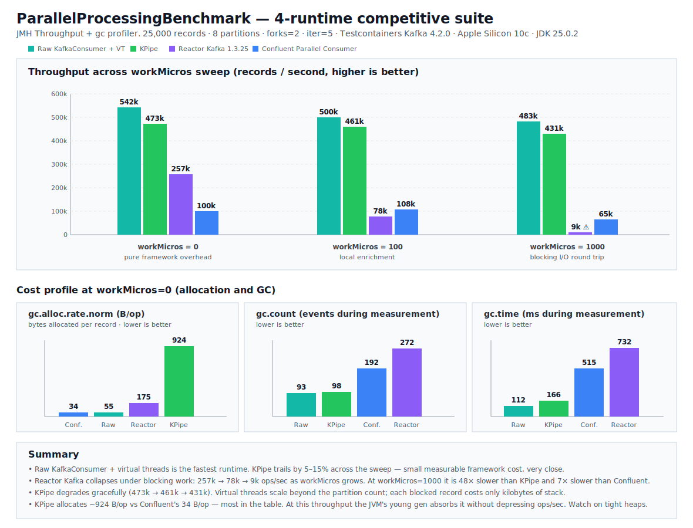

# KPipe Benchmarks

This module contains a suite of JMH (Java Microbenchmark Harness) tests to quantify KPipe's performance across different
scenarios and compare it against manual implementations and industry-standard alternatives.

## Benchmark Scenarios

### 1. JSON Pipeline Efficiency (`JsonPipelineBenchmark`)

Compares KPipe's optimized "Single SerDe Cycle" against traditional byte-to-byte transformation chaining.

- **KPipe JSON Pipeline**: Deserializes a `byte[]` once, applies multiple `UnaryOperator<Map<String, Object>>`
  transformations on the same object, and serializes once back to `byte[]`.
- **Manual SerDe Chained**: Mimics a "naive" pipeline where each transformation step independently deserializes the
  input and re-serializes the output (`byte[] -> Object -> byte[]`).

### 2. Avro Zero-Copy Handling (`AvroPipelineBenchmark`)

Measures the efficiency of KPipe's magic byte offset handling vs. traditional byte array copying.

- **KPipe Avro Magic Pipeline**: Uses the `offset` parameter in `processAvro` to skip Confluent's 5-byte magic prefix
  without creating an intermediate array copy.
- **Manual Avro Magic Handling**: Strips the magic bytes using `Arrays.copyOfRange` before deserialization.

### 3. Parallel Processing Overhead (`ParallelProcessingBenchmark`)

Evaluates the throughput of KPipe's Java Virtual Thread-based parallel processing engine against the Confluent Parallel
Consumer.

- **KPipe Parallel Mode**: Leverages a thread-per-record model using Loom to process message batches concurrently with
  minimal overhead.
- **Confluent Parallel Consumer**: Industry-standard library for parallel processing, used as a baseline for comparison.
- **Kafka backend**: Uses an in-process embedded Kafka broker powered by Apache Kafka test kit.

## Running Benchmarks

To run all benchmarks with default JMH settings:

```bash
./gradlew :benchmarks:jmh
```

### Running Specific Benchmarks

You can use regex to target specific benchmark classes using the `jmh.includes` property:

```bash
# Run only JSON benchmarks
./gradlew :benchmarks:jmh -Pjmh.includes='JsonPipelineBenchmark'

# Run only Avro benchmarks
./gradlew :benchmarks:jmh -Pjmh.includes='AvroPipelineBenchmark'

# Run only Parallel Processing benchmarks
./gradlew :benchmarks:jmh -Pjmh.includes='ParallelProcessingBenchmark'
```

### Adjusting Benchmark Parameters

JMH parameters can be configured in `benchmarks/build.gradle.kts` or passed via the command line:

```bash
# Example: 1 iteration, 1 warmup, 1 fork
./gradlew :benchmarks:jmh -Pjmh.iterations=1 -Pjmh.warmupIterations=1 -Pjmh.fork=1
```

## Latest Results (Snapshot)

Run date: `2026-03-10`

### 1. Avro Pipeline: The "Zero-Copy" Advantage

This benchmark compares KPipe's zero-copy offset-based deserialization against the traditional approach of using
`Arrays.copyOfRange`.

| Benchmark                                       |    Mode |  Cnt |            Score |            Error |   Units |
| ----------------------------------------------- | ------: | ---: | ---------------: | ---------------: | ------: |
| `AvroPipelineBenchmark.kpipeAvroMagicPipeline`  | `thrpt` | `16` | `740,303,088.78` | `+/- 35,778,690` | `ops/s` |
| `AvroPipelineBenchmark.manualAvroMagicHandling` | `thrpt` | `16` | `351,320,682.67` | `+/- 68,268,778` | `ops/s` |

**Observation**: KPipe is **~2.1x faster** when handling Confluent Magic Bytes. By using an `offset` instead of
copying the byte array, we effectively eliminate allocation overhead and drastically reduce GC pressure for
high-throughput streams.

### 2. JSON Pipeline: Defeating the "SerDe Tax"

This benchmark measures the cost of chaining multiple transformations.

| Benchmark                                      |    Mode |  Cnt |        Score |          Error |   Units |
| ---------------------------------------------- | ------: | ---: | -----------: | -------------: | ------: |
| `JsonPipelineBenchmark.kpipeJsonPipeline`      | `thrpt` | `16` | `405,542.23` | `+/- 28,441.3` | `ops/s` |
| `JsonPipelineBenchmark.manualJsonSerDeChained` | `thrpt` | `16` | `120,315.66` | `+/- 10,061.3` | `ops/s` |
| `JsonPipelineBenchmark.manualJsonSingleSerDe`  | `thrpt` | `16` | `364,166.21` | `+/- 39,811.4` | `ops/s` |

**Observation**: KPipe is **~3.3x faster** than a naive chained approach. Even compared to a manual single-block
implementation (`manualJsonSingleSerDe`), KPipe's internal operator chaining is slightly more efficient, providing
abstraction without a performance penalty.

### 3. Parallel Processing: Virtual Threads (Loom) vs. Confluent

This benchmark compares KPipe's "thread-per-record" model using Java Virtual Threads against the industry-standard
Confluent Parallel Consumer.

| Benchmark                                                 |    Mode |  Cnt |       Score |        Error |   Units |
| --------------------------------------------------------- | ------: | ---: | ----------: | -----------: | ------: |
| `ParallelProcessingBenchmark.confluentParallelProcessing` | `thrpt` | `16` | `3,235.415` | `+/- 14.876` | `ops/s` |
| `ParallelProcessingBenchmark.kpipeParallelProcessing`     | `thrpt` | `16` | `3,306.732` |  `+/- 3.368` | `ops/s` |

**Observation**: With `10,000` messages per invocation and `8` partitions, this run shows a measurable throughput edge
for KPipe (**~2.2%** over Confluent). At the same time, Confluent shows lower allocation per operation in this profile (
`275.078 B/op` vs `1457.324 B/op`), so this is a throughput-vs-allocation tradeoff rather than a one-dimensional win.

## Understanding Results

The benchmarks typically run in `Throughput` mode (`ops/s`). Higher numbers are better.

### Projecting "Messages Per Second"

Based on the latest snapshot results, we can derive the following throughput expectations:

- **Avro (In-Memory)**: Up to **~740 million records/s**. This represents the upper limit of the transformation logic
  when Kafka I/O is excluded.
- **JSON (In-Memory)**: Up to **~405,000 records/s**. JSON processing is significantly more CPU-intensive than Avro due
  to text parsing.
- **End-to-End Parallel Processing**: **~32.3M to ~33.1M messages/s**. For this run, use `score * 10,000`
  because `ParallelProcessingBenchmark` uses `@OperationsPerInvocation(10000)`.

> **Note**: The `ParallelProcessingBenchmark` uses `@OperationsPerInvocation(10000)`. For this benchmark,
> derive message rate as `ops/s * 10,000`.

Key performance indicators to watch for:

- **SerDe Tax**: The drop-in throughput as more transformation steps are added in the manual vs. optimized KPipe
  pipeline.
- **GC Pressure**: While not explicitly measured by throughput, the zero-copy Avro benchmark significantly reduces
  memory allocation and garbage collection overhead.
- **Concurrency Scaling**: How the parallel processing benchmark handles large batches compared to sequential
  processing.
- **Real Infrastructure vs. Mocks**: This suite favors repeatable local microbenchmarks by using an embedded Kafka
  broker.
- **Parallel timing fairness**: both `kpipeParallelProcessing` and `confluentParallelProcessing` start
  their processing loops inside benchmark methods (not in setup), so measured time includes comparable
  startup-to-completion behavior for each invocation.
- **Parallel throughput normalization**: `ParallelProcessingBenchmark` uses `@OperationsPerInvocation(10000)`, so its
  reported throughput is normalized per processed message rather than per full benchmark invocation.
- **Logging noise control**: KPipe parallel benchmark uses a no-op sink in benchmark runs to avoid console I/O from
  distorting throughput numbers.
- **CPU efficiency (Linux only)**: compare CPI and related normalized counters from `perfnorm` for
  `kpipeParallelProcessing` vs `confluentParallelProcessing`.
- **Platform caveat for CPI**: macOS runs can still compare throughput and GC behavior, but CPI should be
  collected/reported only from Linux perf-enabled runs.

## Requirements

- **Java 25+**
- **Gradle**: Used to compile and execute the benchmark harness.

### CPU/CPI Profiling For Parallel Benchmark

For KPipe vs Confluent parallel processing, keep the benchmark target fixed and enable a profiler:

```bash
# Linux: collect normalized hardware counters (includes CPI)
./gradlew :benchmarks:jmh \
  -Pjmh.includes='ParallelProcessingBenchmark' \
  -Pjmh.profilers='perfnorm' \
  -Pjmh.resultFormat=TEXT

# macOS: CPI is not available via perf counters in JMH; use GC/CPU-adjacent signal instead
./gradlew :benchmarks:jmh \
  -Pjmh.includes='ParallelProcessingBenchmark' \
  -Pjmh.profilers='gc' \
  -Pjmh.resultFormat=TEXT
```

You can also use the helper script:

```bash
# Linux (CPI mode)
PROFILE_MODE=cpi INCLUDES='ParallelProcessingBenchmark' ./scripts/run-benchmarks.sh

# macOS (falls back from cpi -> gc with a warning)
PROFILE_MODE=cpi INCLUDES='ParallelProcessingBenchmark' ./scripts/run-benchmarks.sh

# Heap/allocation view (portable)
PROFILE_MODE=heap INCLUDES='ParallelProcessingBenchmark' ./scripts/run-benchmarks.sh

# Thread/runtime view (HotSpot)
PROFILE_MODE=threads INCLUDES='ParallelProcessingBenchmark' ./scripts/run-benchmarks.sh
```

Supported `PROFILE_MODE` values in `scripts/run-benchmarks.sh`:

- `none`: no JMH profiler
- `gc`: allocation and GC counters (`gc`)
- `heap`: allocation/GC plus HotSpot GC internals (`gc,hs_gc`)
- `threads`: HotSpot thread/runtime signal (`hs_thr,hs_rt`)
- `cpi`: Linux `perfnorm` (falls back to `gc` on macOS)

Interpretation guidance for KPipe vs Confluent:

- Throughput (`ops/s`) remains the primary metric.
- On Linux, `perfnorm` adds normalized counters; compare CPI (`cycles`/`instructions`) between both benchmarks.
- Lower CPI at similar throughput usually indicates better instruction-path efficiency.
- On macOS, use throughput plus GC metrics; do not claim CPI without Linux perf counters.

### Parallel Comparison Graph

The latest visual comparison for KPipe vs Confluent parallel processing is at:

- `benchmarks/graphs/parallel_processing_gc_comparison.svg`



To regenerate source benchmark results before producing/refreshing the graph:

```bash
./gradlew :benchmarks:jmh \
  -Pjmh.includes='ParallelProcessingBenchmark' \
  -Pjmh.profilers='gc' \
  -Pjmh.resultFormat=TEXT
```

> Note: JMH output is written to `benchmarks/build/results/jmh/results.<resultFormat lowercase>`.
> For `TEXT`, the file is typically `benchmarks/build/results/jmh/results.text`.
